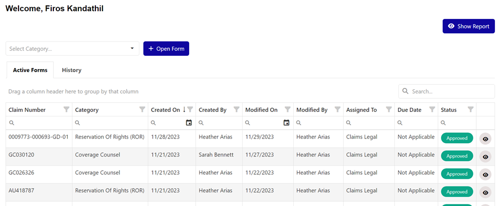
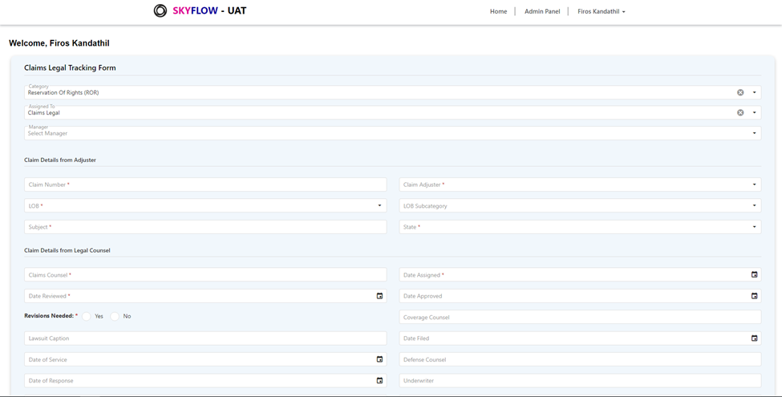

# JS-task 01

Sample Public APIs: https://dummyjson.com/
DevXtreme Datagrid: https://js.devexpress.com/jQuery/Documentation/Guide/UI_Components/DataGrid/Getting_Started_with_DataGrid/
DevXtreme Select box: https://js.devexpress.com/jQuery/Documentation/Guide/UI_Components/SelectBox/Getting_Started_with_SelectBox/

Dev Extreme Import Script for the HTML File

<link rel="stylesheet" href="https://cdn3.devexpress.com/jslib/22.1.3/css/dx.light.css" />
<link rel="stylesheet"  href="https://cdnjs.cloudflare.com/ajax/libs/font-awesome/6.1.1/css/all.min.css">

Page 01:

Page 02: It should be opened on a new window with the selected item details (You can set the selected item id as the URL parameter to fetch the details on this page)
There are two ways to open the second page,
1)	By clicking the eye icon on first page row
2)	Double clicking the row

# JS-task 02

Sample Public APIs: https://dummyjson.com/
DevXtreme Form: https://js.devexpress.com/jQuery/Demos/WidgetsGallery/Demo/Form/Overview/MaterialBlueLight/
DevXtreme Select box: https://js.devexpress.com/jQuery/Documentation/Guide/UI_Components/SelectBox/Getting_Started_with_SelectBox/

Dev Extreme Import Script for the HTML File

<link rel="stylesheet" href="https://cdn3.devexpress.com/jslib/22.1.3/css/dx.light.css" />
<link rel="stylesheet"  href="https://cdnjs.cloudflare.com/ajax/libs/font-awesome/6.1.1/css/all.min.css">

Page 01:
Continuation to the JS Task 01, I should be able to add new product as well now. When you select the category from the First Page, click on Add Product Button it should open a blank form with all the required form fields. Use the DevXtreme Form to design the forms (Link above). Saving is not required, but all the validations should be there.
Selected category should be already selected in the opened new form page.

# JS-task 03

Page 02:
Add one more select box in the details page, with the product details of the selected category. Whenever the product is selected, fill the other fields with its corresponding values.  